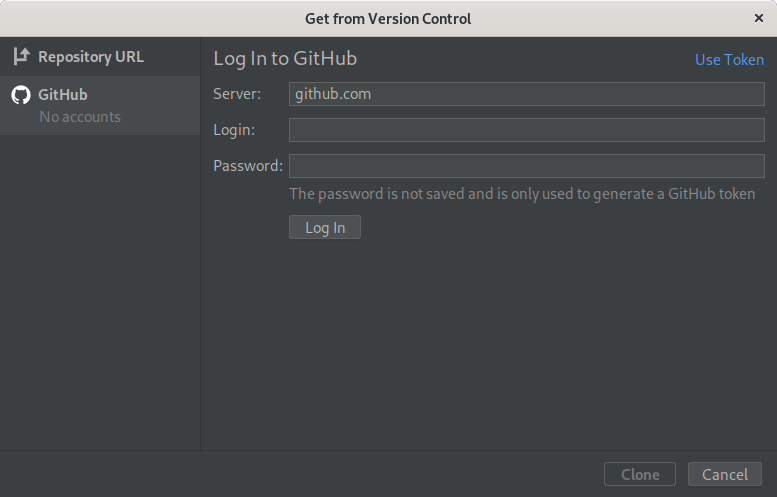
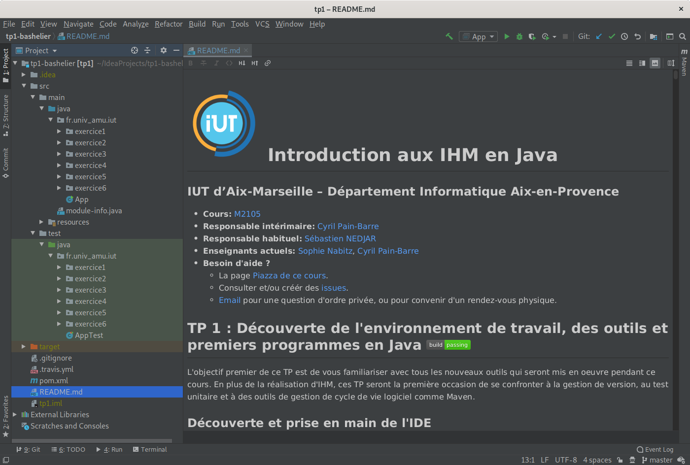

# Découverte et prise en main de l'IDE

Pendant les atelier, j'utilise souvent l'environnement de développement intégré **[IntelliJ IDEA](https://www.jetbrains.com/idea/)** de chez **[JetBrains](https://www.jetbrains.com)**. Cet IDE spécialisé dans Java est l'un de ceux qui possèdent la meilleure intégration native d'outils comme Git, GitHub et Maven.

Rien ne vous empêche d'en utiliser un autre bien évidement. VSCode par exemple suffit largement pour l'ensemble des katas dans n'importe quel langage.

IntelliJ IDEA possède deux versions, la première dite *'communautaire'*, qui est totalement open source et peut être utilisée gratuitement par n'importe qui et la seconde dite *'ultimate'* qui est plus riche en fonctionnalité et qui n'est pas gratuite pour les individus lambda.

Pour les étudiants, vous avez la possibilité de bénéficier d'une licence pour tous les produits JetBrains. Il vous faudra acquérir (gratuitement) une licence étudiant en remplissant [ce formulaire](https://www.jetbrains.com/shop/eform/students).

Quelques minutes après, vous recevrez un email de confirmation suivi d'un second email d'activation ou vous devrez accepter les conditions d'utilisation et choisir un nom d'utilisateur et un mot de passe. Conservez précieusement ces informations dans un coin identifié de votre cerveau car c'est grâce à elles que vous pourrez importer votre licence.

## Lancement et paramétrage de l'IDE

Ouvrez 'IntelliJ IDEA Ultimate Edition'. Acceptez la licence et faites votre choix concernant la transmission de données d'utilisation. Il ne reste qu'à saisir vos données de connexion pour commencer à utiliser votre IDE.

## Import du projet dans l'IDE

Pour pouvoir maintenant travailler sur votre code, il vous faut cloner votre dépôt GitHub et l'importer dans l'IDE.

Pour ce faire cliquez sur 'Get from VCS' puis sur 'GitHub'. Vous allez arriver sur la fenêtre de connexion à GitHub.



Cliquez sur *"Use token"*, puis sur le bouton *"generate"*. Une fenêtre va s'ouvrir et va vous permettre de générer un token sur votre compte GitHub qui vous authentifiera désormais sur GitHub depuis IntelliJ IDEA. Copiez le token dans le champ *"Token"* et vous devriez pouvoir vous connecter à votre compte.

La liste de vos dépôts GitHub devrait apparaître. Ici sélectionnez votre fork généré pas github classroom. Mémorisez bien le dossier dans lequel vous clonez votre projet. Vous pourrez y accéder par la suite en ligne de commande pour soumettre vos changement et les pousser sur votre dépôt distant.

En cas de difficulté à retrouver votre fork du TP, vous pouvez simplement en indiquer l'URL dans la barre du haut. Cette URL est celle obtenue sur le site GitHub du dépôt en cliquant sur *"Clone or download"* (le bouton vert à droite) et en choisissant *"Clone with HTTPS"*.

Après avoir cliquer sur *"Clone"*, le clonage du dépôt commence.

*IntelliJ IDEA* devrait détecter que votre projet possède un fichier `pom.xml`, et importer toutes les dépendances du projet.

## Découverte de l'IDE

Lorsque vous ouvrez votre projet, vous arrivez sur une fenêtre comme celle-ci :



où la vue projet devrait être déjà développée et le (ce !) fichier `README.md` affiché.

Si ce n'est pas le cas, passer la souris sur l’icône représentant une carré en bas à gauche et sélectionnez 'Project' pour avoir la vue de votre projet.

Dans cette vue, vous pouvez voir les différents dossiers de votre projet. Pour le TP, vous travaillerez principalement dans deux d'entre eux :

- `src/main/java/dev/craftlr/` : Qui contiendra l'ensemble du code applicatif (le code des exercices).
- `src/test/java/dev/craftlr/` : Qui contient les classes de test associées (le code vous aidant à vérifier votre solution).

Notez qu'IDEA regroupe sur l'interface `dev/craftlr` en `dev.craftlr` car les répertoires ne contiennent qu'un seul élément. Vous pouvez utiliser un terminal ou l'explorateur de fichiers du système pour explorer plus en détail l'arborescence de votre projet :

```bash
~/workshop-tdd$ tree ./ -I 'target*|resources*'
├── decouverte_et_prise_en_main_IDE.md
├── pom.xml
├── README.md
└── src
    ├── main
    │   └── java
    │       ├── dev
    │       │   └── craftlr
    │       │       ├── App.java
    │       │       ├── exercice1
    │       │       │   └── HelloWorld.java
    │       │       ├── exercice2
    │       │       │   └── FizzBuzzer.java
    │       │       ├── exercice3
    │       │       │   └── ConvertisseurDeNombreRomain.java
    │       │       ├── exercice4
    │       │       │   ├── GridPosition.java
    │       │       │   ├── Movement.java
    │       │       │   ├── Orientation.java
    │       │       │   ├── Robot.java
    │       │       │   └── RobotSimulator.java
    │       │       └── exercice5
    │       │           └── MinesweeperBoard.java
    │       └── module-info.java
    └── test
        └── java
            └── dev
                └── craftlr
                    ├── AppTest.java
                    ├── exercice1
                    │   └── HelloWorldTest.java
                    ├── exercice2
                    │   └── FizzBuzzTest.java
                    ├── exercice3
                    │   └── ConvertisseurDeNombreRomainTest.java
                    ├── exercice4
                    │   └── RobotTest.java
                    └── exercice5
                        └── MinesweeperBoardTest.java

19 directories, 20 files
```

## Exécution de la classe App

Cette classe principale `App` du package `dev.craftlr` n'est qu'une classe "témoin" pour s'assurer que tout fonctionne normalement. Ouvrez la dans IDEA et observez son code :

```java
package dev.craftlr;

/**
 * Hello world!
 *
 */
public class App 
{
    public static void main( String[] args )
    {
        System.out.println("Affichage des arguments de la ligne de commande :");
        for (String arg : args) {
            System.out.println(arg);
        }
    }
}
```

On retrouve :

- l'instruction `package` indiquant à quel package appartient la classe

- l'instruction `public class App` commençant la définition de la classe. Notez que le fichier qui la contient doit avoir le même nom, avec l'extension `.java` ;

- la définition de la méthode **publique** et **statique** `main` prenant en paramètres un tableau de `String` qui en fait une **classe exécutable** (la signature est stricte ; une méthode `main` qui n'aurait pas cette signature ne rendrait pas la classe exécutable). Dans cette méthode :

  - l'instruction `System.out.println()` permet d'afficher un message sur la console en allant à la ligne ;
  
  - la boucle `for` est une boucle de type *foreach* qui permet de parcourir le tableau de `String` en attribuant à la variable `arg` un nouvel élément du tableau à chaque itération ;
  
  - une nouvelle instruction `System.out.println()` qui affiche l'élément courant

Pensez à changer le JDK pour utiliser celui que vous avez télécharger précédemment.

Pour exécuter la classe principale `App.java` qui devrait apparaître avec l'icône  (icône de classe avec triangle vert) indiquant qu'on peut l'exécuter. Pour ce faire, dans la vue 'Project' effectuez un clic droit sur `App` et choisir Run 'App.main()'.

En bas de la fenêtre, vous devriez voir le résultat de l'exécution de cette classe sur la console d'exécution.

Puisque nous n'avons pas fourni d'argument à l'exécution de la classe, la boucle n'affiche rien. Pour en donner sans passer par la ligne de commandes, il faut passer par le menu 'Run' puis 'Edit Configurations...' (ou clic droit sur la classe et 'Edit App.main()...' pour ouvrir un menu similaire) et saisir les arguments dans la zone 'Program arguments:' :


puis valider. Une nouvelle exécution de `App` affichera sur la console  :

```sh
Affichage des arguments de la ligne de commande :
zéro
un
deux
trois
quatre
```

## En cas de complications

Il se peut que tout ne se déroule pas comme prévu et que vous ne parveniez pas à exécuter `App`.

Si le triangle vert n'apparaît pas sur le nom de cette classe, il se peut que le projet n'ait pas été correctement importé comme un projet maven (un outil de gestion du cycle de vie d'une application). Dans ce cas faire un clic droit sur le fichier `pom.xml` puis sélectionner 'Maven' puis 'Reimport' (ou 'Import as a maven project').

Si ça ne règle pas le problème, il se peut que IDEA ne trouve pas le JDK (SDK) si l'installation n'a pas été correctement réalisée. Aller dans le menu 'File' puis 'Project Structure' et :

- dans la partie 'Project SDK' de 'Project Settings', vérifiez que vous utilisez bien le JDK souhaité

- dans la partie 'SDKs' de 'Platform Settings', 19 doit apparaître avec son JDK home path, sinon ajouter manuellement le JDK que vous avez installé.
